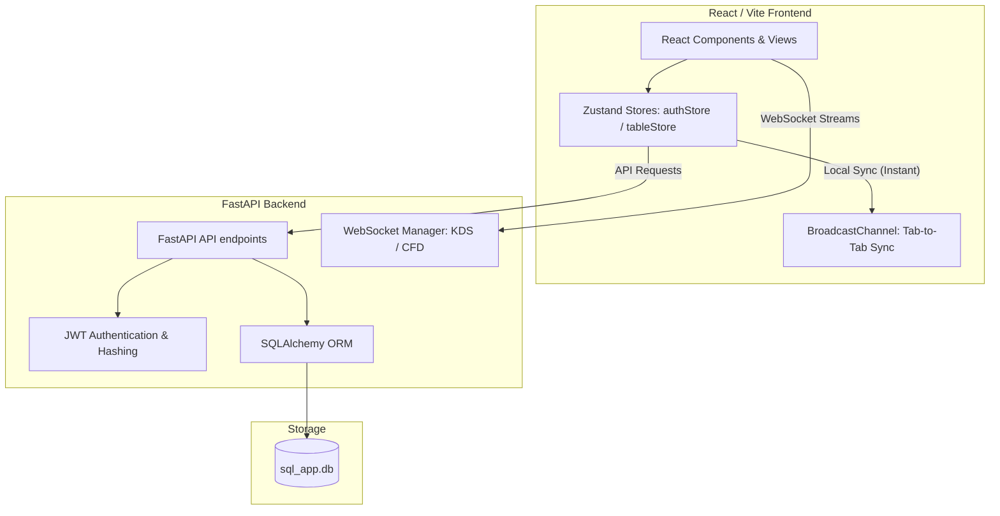

# Odoo Cafe POS - Full-Stack Documentation (`readme_current`)

Welcome to the **Odoo Cafe POS & Restaurant Management System** code documentation. This is a monolithic full-stack repository containing a modern, high-performance React frontend powered by Vite and a robust Python FastAPI backend with SQLite.

---

## 🏗️ Architecture Overview

The project is structured as a full-stack monolith to enable rapid development and prevent complex merge conflicts between the frontend and backend teams:
- **Frontend App**: Located in the `src/` folder, structured with React components, layouts, store management (Zustand), and routing (React Router v7).
- **Backend API Core**: Python-based backend files located directly in the root directory (`main.py`, `auth.py`, `models.py`, `schemas.py`, etc.).
- **Database**: SQLite database stored locally as `sql_app.db`.



---

## 🛠️ Technology Stack

### Frontend
- **Framework:** React 19 & Vite (for lightning-fast hot module replacement)
- **State Management:** Zustand (with custom `persist` middleware for session state)
- **Styling & Theme:** Tailwind CSS & PostCSS
- **Animations:** Framer Motion (for fluid, cinematic UI transitions)
- **Icons:** Lucide React
- **HTTP Client:** Axios (configured with base URL in `src/api.js`)

### Backend
- **Framework:** FastAPI (Python 3.8+)
- **WSGI/ASGI Server:** Uvicorn
- **Database ORM:** SQLAlchemy
- **Database Engine:** SQLite (local `sql_app.db`)
- **Authentication:** JWT (JSON Web Tokens) via `python-jose` and `passlib` (bcrypt)
- **Data Validation:** Pydantic v2 schemas

---

## ✨ Standout Features & Implementations

### 1. Sliding Glassmorphism Authentication Flow
- **Files:** `src/pages/AuthPage.jsx`, `src/store/authStore.js`, `auth.py`
- **Logic:** Features a custom, dual-panel sliding authentication UI (Sign In and Sign Up panels sliding over each other with glassmorphism styling). It is fully integrated with the FastAPI JWT endpoints (`/api/auth/signup` and `/api/auth/login`), storing tokens and routing roles dynamically.
- **Route Protection:** Seamlessly intercepts unauthenticated checkouts, redirects users to login, and returns them to checkout upon success.

### 2. Optimistic Table Sync (BroadcastChannel & DB Hybrid)
- **Files:** `src/store/tableStore.js`, `main.py`
- **Logic:** 
  1. **Instant UI Response:** When a table status changes, a browser-level `BroadcastChannel` immediately synchronizes state across all open browser tabs/windows on that device.
  2. **Background Database Commit:** Simultaneously triggers a `PATCH /api/tables/{id}` request to the FastAPI server in the background.
  3. **Auto Rollback:** If the network request fails, the store rolls back the local status immediately to prevent inconsistent states.

### 3. Kitchen Display System (KDS) via WebSockets
- **Files:** `src/pages/KitchenDisplay.jsx`, `main.py`
- **Logic:** Uses WebSockets (`/ws/kds`) to establish a persistent connection between the POS checkout and the kitchen crew. Placing an order pushes a JSON payload through FastAPI's WebSocket connection manager, prompting immediate visual updates in the kitchen view without polling.

### 4. Customer Facing Display (CFD)
- **Files:** `src/pages/CustomerDisplay.jsx`, `main.py`
- **Logic:** Allows dynamic cart updates to be broadcasted to customer-facing screens via WebSocket endpoints (`/ws/cfd/{table_id}`) using the `/api/cfd/update` handler.

### 5. Infinite Scroll Cinematic POS Layout
- **Files:** `src/pages/POS.jsx`, `src/components/OrderView/ProductGrid.jsx`
- **Logic:** A premium theme featuring:
  - Ambient glowing blobs and responsive glass backdrops.
  - Infinite scroll carousel for selecting menu categories.
  - Floating product cards with top-border breakout design elements (`absolute -top-12`) and scale animations.

---

## 🗄️ Database Schema & Models

Below is the database structure defined in `models.py`:

| Model | Fields | Description |
| :--- | :--- | :--- |
| **User** | `id`, `name`, `email`, `username`, `hashed_password`, `role`, `is_active` | Accounts for `admin`, `employee`, and `customer` roles. |
| **Category** | `id`, `name`, `color` | Food categories (e.g., Hot Coffee, Food) with hex colors for UI tags. |
| **Product** | `id`, `name`, `price`, `tax_percentage`, `category_id` | Cafe items linked to a category. |
| **Table** | `id`, `number`, `seats`, `status`, `occupied_by` | Floor plan table configuration. Status can be `available` or `occupied`. |
| **Order** | `id`, `table_id`, `customer_id`, `total_amount`, `tax_amount`, `discount_amount`, `status`, `created_at` | Tracks transaction status (`To Cook`, `Cooking`, `Ready`, etc.). |
| **Coupon** | `id`, `code`, `discount_type`, `value`, `is_active` | Handles percentage or fixed-amount discounts. |
| **POSSession** | `id`, `employee_id`, `is_open`, `opened_at`, `closed_at`, `closing_amount` | Tracks employee shift login/logout status and cash registers. |

---

## ⚡ Setup & Run Instructions

### 📥 1. Prerequisites
Ensure you have the following installed on your machine:
- **Node.js** (v18 or higher) & **npm**
- **Python** (v3.8 or higher) & **pip**

---

### 🐍 2. Backend Setup
Navigate to the root workspace directory.

1. **Install Python dependencies:**
   ```bash
   pip install fastapi uvicorn sqlalchemy passlib[bcrypt] python-jose[cryptography] pydantic
   ```
   > [!IMPORTANT]
   > Due to internal passlib compatibility changes, if you encounter a `bcrypt` Attribute error, downgrade your bcrypt library version:
   > ```bash
   > pip install "bcrypt<4.0.0"
   > ```

2. **Initialize & Seed Database:**
   We provide a utility script `seed.py` that populates categories, products, floor plan tables, and default users.
   To run this on Windows PowerShell without emoji encoding errors, set the encoding environment variable:
   ```powershell
   $env:PYTHONIOENCODING="utf-8"
   python seed.py
   ```

3. **Start the API Server:**
   Launch the FastAPI application with Uvicorn:
   ```bash
   uvicorn main:app --reload
   ```
   The backend will start and run on: **`http://localhost:8000`**

---

### ⚛️ 3. Frontend Setup
In the same root directory, open a new terminal window:

1. **Install Node modules:**
   ```bash
   npm install
   ```

2. **Start Vite Development Server:**
   ```bash
   npm run dev
   ```
   The frontend will start and run on: **`http://localhost:5173`**

---

## 🔑 Default Login Credentials

Use the following seeded accounts to log in and test different system interfaces:

- **Admin Portal Access** (`/admin` routes)
  - **Email:** `admin@cafe.com`
  - **Password:** `admin123`
  - **Role:** Administrator (full analytics, payment configuration, product listing edits)

- **POS Cashier View** (`/pos` & `/floor` routes)
  - **Email:** `john@cafe.com`
  - **Password:** `pos123`
  - **Role:** Cashier / Waiter (session management, checkout billing, order dispatcher)
